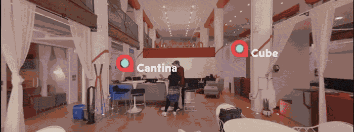

# Unity - 360 Video

## Learning objectives

- What is 3DOF vs 6DOF
- What VR headsets are on the current market and how to target them
- What is 360 video and what are its potential use cases
- What is the difference between monoscopic and stereoscopic 360 video
- What are render textures
- How to use Unity’s Video Player component
- How to use VR in Unity (basics)

## What is this project about

- 360 video tour in the San Francisco campus

## Attribution

- Tech Live by Kevin MacLeod Link: https://incompetech.filmmusic.io/song/4463-tech-live
- - License: https://filmmusic.io/standard-license

## Visual informations about the project :

 

## How to move in the scene

 

## Hotspots

 

 

## Informations Spots

 

